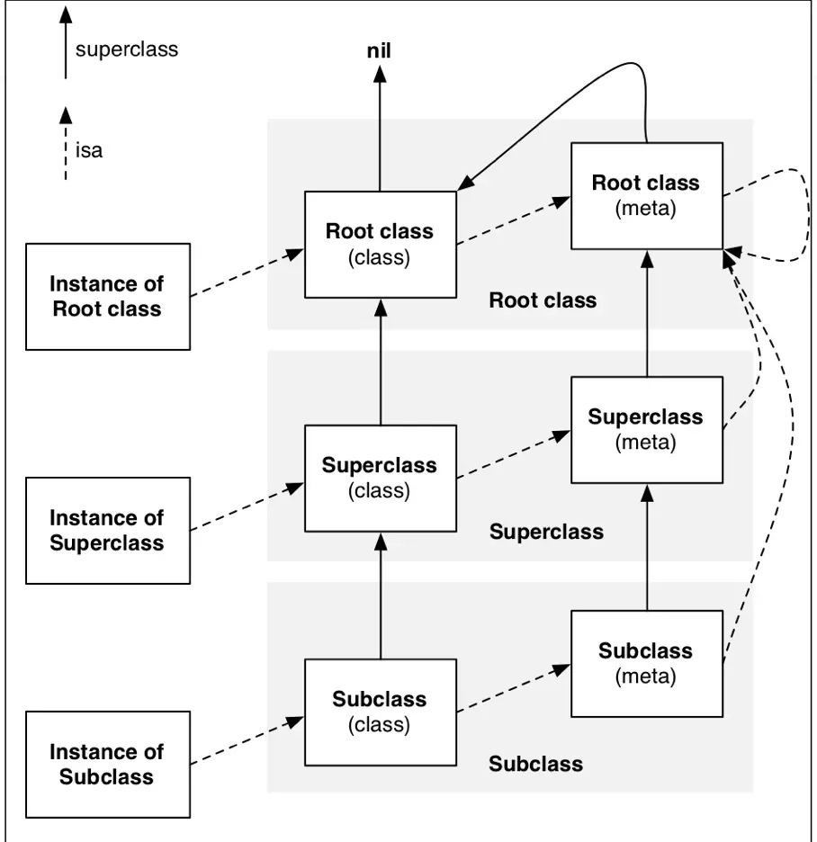

# iOS 底层开发
## 写在最前面
####2016.9
学习iOS至今已经一年多了，包括实习也有了一年的时间了，这一年的工作里，用得比较多的还是界面逻辑，空间，动画等以及一些数据操作等。偶尔也犯犯嘀咕，最繁琐的逻辑问题，比如说排序啦，筛选啦、搜索啦这些涉及到效率复杂度的东西已经在后台进行处理过了，服务端返回给你的数据就大致已经是你需要的那堆数据了。
接触多了这些东西，感觉好像app前端开发的东西有点...无脑？2333其实也不能这么说，不过至少最需要智商的算法我很少用得到。学习iOS也已经快一年了，扪心自问下自己目前的水平是否就是一年经验的水平了。所以说，惭愧之下，开始接触更底层的东西，比如说消息机制、Runtime等等这些一直不敢去涉及的东西


####2018.12

也是实在没想到，第二次编辑这篇博客是在两年以后了，也难为了收藏这篇博客的2位哥们 (虽然他们可能是随便那么收藏一点 2333)。上一次编辑这篇博客之后，我就从研究所离职了，那儿真不是人干的，太特么闲了，后来去了一家外企，不忙但是越来越懒惰了，都不想着去底层开发，这边学点java后台，那边学点数据库Swift之类的杂七杂八的。

等到现在回过头看这篇博客的时候，才发现上一次编辑的前言中，我还在惭愧还在扪心自问，现在怕是堕落了。三年的工作经验，慢慢变成了老油条，但是技术水平好像也没什么大的成长，这回是真真的惭愧的紧了。

过几天就是2019年了，前几天看到有位开发的同僚发了篇博客总结今年的成果和展望明年的目标有点触动，因此不再这里大篇幅写了，元旦的时候也写篇来总结总结反思反思。

现在开始慢慢填坑吧...
#### 2019.11
............(一切尽在不言中)

##目录
+ 前言
+ 名词解释
+ OC消息传递和转发机制
+ Runtime
+ Runloop
+ Method Swizzling黑魔法
+ 自己动手写一个框架
+ Category实现原理
+ 反射机制
+ ...

### 小结
**_1. 关于博客中的源码内容_**
在查看 _`<objc/runtime.h>`_ 的过程中，我发现头文件源码中很多都有用到宏定义 `OBJC2_UNAVAILABLE` 以及用 `#if !__OBJC2__ endif` 来区别是否是 Objective-C 2.0+ , 那么也就是说我们看到的这些方法其实很多都已经不适用于当前的 Objective-C 版本，最新的很多都看不到了。不过 runtime 的源代码苹果已经开源。我们可以从官网下载到源码 ->[源码下载地址](https://opensource.apple.com/tarballs/objc4/)。在源码中我们可以看到这些对象里面都有些什么。

**_2. 关于使用哪种方式来定义属性的类型_**
我注意到在源码 _`<objc/runtime.h>`_ 的注释中有写到 `/* Use Class' instead of 'struct objc_class *' */ `, 可以推断，苹果其实都不建议直接用结构体指针来命名该类型类型的值。


##名词解析
####1. 源码 `<objc/objc.h>` 中的名词
#####①实例对象 ===>  id 和结构体 objc_object
```objc
/// A pointer to an instance of a class.
typedef struct objc_object *id;
```
源码指出，**id** 是指向 **objc_object** 的指针。而注释告诉我们，**id** 就是一个指向某个类的**实例对象**的指针。那 **objc_object** 就是某个类的**实例对象**，如下:
```objc
/// Represents an instance of a class.
struct objc_object {
    Class _Nonnull isa  OBJC_ISA_AVAILABILITY;
};
```
注释说明, **objc_object 表示一个类的实例**。**objc_object** 里面有一个 Class 类型的 isa 指针，这个指针指向了这个对象的类对象

#####②类 ==== Class 和结构体 objc_class
```objc
/// An opaque type that represents an Objective-C class.
typedef struct objc_class *Class;
```
从源码中可以看出，**Class** 是一个指向 **objc_class** 结构体的指针.注释告诉我们，**Class** 表示一个 Objective-C 类。那么 **objc_class** 又是什么？
```objc
//<objc/runtime.h> 源码中
//(忽略 Objective-C 2.0 不支持的属性)
struct objc_class {
    Class _Nonnull isa  OBJC_ISA_AVAILABILITY;
};
```
从中可以知道 **objc_class** 结构体中也有个 Class 类型的 isa 指针。等等，看到这里是不是觉得有点奇怪，似乎和上面说到的 **objc_object (对象)** 一模一样。我们可以看到，类里面又有个类的指针。那这个 isa 指针又指向的是什么呢？
> 其实这里仅仅从源码来看，我们并不知道这里的isa指向了哪里，反正不是父类，因为父类下面还有个 **superclass** 指向了它的父类
> 那 isa 指向了哪里呢? 只能通过网上的解答来解释了:
> **isa指向的是它的metaclass(元类)** 元类也是 **objc_class** 的另一种对象

```objc
///"objc-runtime-new.h"源码
struct objc_class : objc_object {
    // Class ISA;
    Class superclass;
    cache_t cache;             // formerly cache pointer and vtable
    class_data_bits_t bits;    // class_rw_t * plus custom rr/alloc flags

    class_rw_t *data() { 
        return bits.data();
    }  //这个结构体里有所有的变量列表，方法列表等
}
```

---
###### 关于类和对象
> 我们常说的对象，一般指的是 实例对象。 但其实对象不仅仅是实例对象，还有其他的, 比如类对象. 我们上面有说到，**objc_class** 和 **objc_object** 几乎一致，那我们从 runtime 的源码下继续深入研究中看到
```objc
//"objc-runtime-new.h"源码
struct objc_class : objc_object {
    ...
}
```
从这里看出，objc_class 是继承了 objc_object 的结构体。这里的源码我们其实可以先得出一个结论:
 **类也是一个对象**
 
 
###### 关于 metaclass 元类
> 在国外大牛的文章：[What is a meta-class in Objective-C?](http://www.cocoawithlove.com/2010/01/what-is-meta-class-in-objective-c.html) 中对 **metaclass** 的解释总结过来有三个要点：
> 1. **metaclass** 元类也是一个对象，是一个 **obj_class** 的一种，即是类对象的一种。这意味着, 你也可以对这些元类作为对象来发送消息。也因此每个Class都有其 metaclass 原类
> 2. 所有的 **metaclass** 元类都使用同一个基础类的 元类。这意味着 几乎所有的**metaclass** 元类都是 ‘**NSObject**的元类’ 的派生类。 
> 3. 几乎所有的 **metaclass**元类 上的 isa 指针 指向的都是 ‘**NSObject**的元类’.元类也有个 **isa** 指针指向 **root meteClass** 根元，根元的 **isa** 指针指向自己
>  
> 最后来一张经典图片收尾
> 

---

##### ③方法选择器 ==== SEL 和结构体 objc_selector
```objc
/// An opaque type that represents a method selector.
typedef struct objc_selector *SEL;
```
**SEL** 是 **objc_selector** 结构体的指针，表示了一个方法的选择器。结构体的内容在 **runtime.h**和**obj.h** 的源码中无法找到，所以我们无法得知 **objc_selector** 到底是什么。不过很多 Blog 和书籍中指出: " SEL 其实也是其中一种数据类型，用来定义类方法，是类成员方法的指针，本质上其实只是一串字符串。”**（其实可以看做是类方法的identifier）**，接下来验证这种说法是否正确
```objc
// 首先，我们先定义一个 SEL, 定义 SEL 可以有多种方式
SEL aSelector = @selector(SEL selector);

SEL bSelector = SEL sel_registerName(const char *name);
// (NSSelectorFromString 方法就是通过 sel_registerName 方法来注册的 SEL)
SEL cSelector = NSSelectorFromString(NSString *cSelectorName);
// 其实从定义我们就可以看出来, SEL 和 字符串 可能存在某种转化。

// 除此之外, 我们输出下这个 SEL 发现：
// 尽管报了 warning ，但是你还是可以看到输出的就是个字符串，而没有报错
NSLog(@"%s",aSelector);


// 另外，我们还可以通过另一个方法来看看 SEL 其实也是个类似Key的东西
// 举例, dog 和 cat 是两个不同的实例对象，都有一个名为 description 的方法
SEL selector1 = @selector(description);
[dog performSelector:selector1];    // 调用 dog 的 description 方法
[cat performSelector:selector1];    // 调用 cat 的 description 方法
// 可以看出虽然 SEL 虽然相同， 但是调用的方法是不同的。
```
那么其实 我们是否可以大胆得得出一个结论：**SEL** 其实就只是 一个方法名 或者说 标识. 这一点其实从
后面的 **objc_method** 结构体中 `SEL method_name` 命名可以看出。

#####④方法实现 ==== IMP
```objc
typedef void (*IMP)(void /* id, SEL, ... */ );                  // 有返回值
typedef id _Nullable (*IMP)(id _Nonnull, SEL _Nonnull, ...);    // 无返回值
```
IMP（Implementation）是一个指向 **方法实现的地址** 的指针，参数都包含 **id** 和 **SEL** 类型。通过 **id** (实例对象)里的 **SEL** (方法名) 获取到唯一的实现方法，[当然，IMP还有更底层更广泛的应用](http://www.cocoachina.com/ios/20150717/12623.html)
> 其实，直接调用方法的IMP指针效率比调用方法本身更高。但是也不要盲目得去用IMP来提高速率，毕竟可读性肯定没有那么高了。


####2. 源码`<objc/runtime.h>`中的名词
#####①实例变量 ==== Ivar 和结构体 objc_ivar
```objc
typedef struct objc_ivar *Ivar;
struct objc_ivar {
    char *ivar_name;  //实例变量名
    char *ivar_type;  //实例变量类型类型
    int ivar_offset;  //基地址偏移字节
    int space;
}
```
Ivar是用来定义对象的实例变量。Ivar是objc_ivar结构体，从结构体看出，Ivar包括类型和名字等。
> 这里有人会奇怪，Ivar (实例) 和 Property (属性) 有什么区别？我个人的想法是Ivar 和 Property主要差别在于property包括了Ivar的属性以外，还封装了setter( ) 和 getter( ) 方法。还有更底层的现在就不去了解了，比如objc_property等

#####②方法 ==== Method 和结构体 objc_method

#####③分类 ==== Category 和结构体 objc_category
#####④协议 ==== Protocol


+ IMP

+ Method
```objc
typeof struct objc_method {
    //方法名
    SEL method_name;      
    //参数以及返回类型
    char *method_types;   
    //指向具体方法实现的指针
    IMP method_imp;       
}
typedef struct objc_method *Method;
```
Method就是函数方法，从源码可知，是一个objc_method的结构体，结构体包括一个SEL属性的方法名(可以看做是这个方法的identifier，可以通过这个属性来获取到该方法)，一个method_types指的是参数以及返回类型的描述字符串,(**后者是博文[Objective-C method及相关方法分析](http://blog.csdn.net/uxyheaven/article/details/40350911)看到的，有待深入研究*)，第三个参数就是指向具体实现方法的IMP指针method_imp。通过这三个成员变量，就可以实现方法了。

+ Class
```objc
typedef struct objc_class *Class;
struct objc_class {
    Class isa;
#if !__OBJC2__
    Class super_class;
    const char *name;
    long version;
    long info;
    long instance_size;
    struct objc_ivar_list *ivars;
    struct objc_method_list **methodLists;
    struct objc_cache *cache;
    struct objc_protocol_list *protocols;
#endif
};  
```

##参考
1. [runtime官方源码下载地址](https://opensource.apple.com/tarballs/objc4/)
2. [深入理解objc中的类与对象](https://www.jianshu.com/p/9128a3ccf1ff)